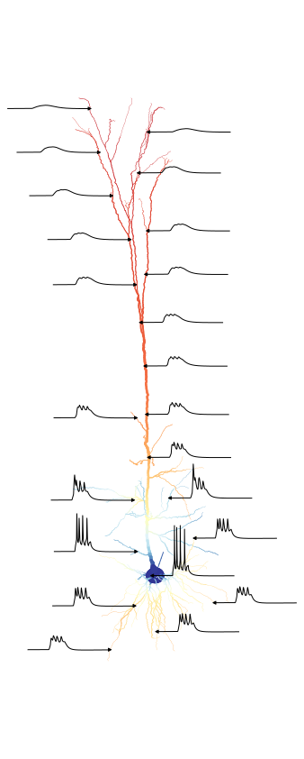

# Layer5Comparison

## Performance analysis for figure 4b

analysis for dt=0.025


| Config      | Run time         | Relative        | _        |
|-------------|------------------|-----------------|----------|
| nmlcc-super | 1.14 sim.s/bio.s | fastest         | 5 trials |
| nmlcc       | 1.33 sim.s/bio.s | 16.598% slower  | 5 trials |
| neuron      | 5.84 sim.s/bio.s | 411.810% slower | 5 trials |

## Plot of 5a

</img>

## ??

Run setup-env.sh to create a environment with versioned simulators

Required dependencies

 - `java` (for pyNeuroML)
 - `cargo` (for nmlcc)

Sources:

 - https://github.com/OpenSourceBrain/L5bPyrCellHayEtAl2011

# Bechmark

Todo
 - Run on Juwels `Intel Xeon Platinum 8168` node
 - Compile with vectorization
 - Install RUST

## Login to Juwels

```
ssh juwels
jutil env activate -p cslns
mkdir -p $SCRATCH/$USER
```


### Set up and build nmlcc:

```
cd $SCRATCH/$USER

curl --proto '=https' --tlsv1.2 -sSf https://sh.rustup.rs | sh
source "$HOME/.cargo/env"

git clone 'https://github.com/llandsmeer/nmlcc' \
    --branch='feat/sm-merge-nonuniform' \
    --recursive
cd nmlcc
cargo install --path .

nmlcc --version
```

### Set up and build arbor (CPU, SIMD)

https://docs.arbor-sim.org/en/latest/install/build_install.html

```
module load Python/3.9.6 GCC/11.2.0 CMake/3.21.1

pyprefix=`python3 -c 'import site; print(site.getusersitepackages())'`

cd $SCRATCH/$USER
git clone --recursive https://github.com/arbor-sim/arbor
cd arbor
mkdir build
cd build
cmake .. \
    -DARB_VECTORIZE=ON \
    -DARB_ARCH=native \
    -DARB_WITH_PYTHON=on \
    -DCMAKE_BUILD_TYPE=release \
    -DARB_USE_BUNDLED_LIBS=ON \
    -DARB_PYTHON_LIB_PATH="${pyprefix}" \
    -DCMAKE_INSTALL_PREFIX=$HOME/.local
make -j 64
make install

python3 -c 'import arbor; print(arbor); print(arbor.config())'
```

### Run the benchmark

```

cd $SCRATCH/$USER

git clone https://github.com/llandsmeer/Layer5Comparison
cd Layer5Comparison

pip3 install pandas neuron

srun --account slns --partition batch --mem 80G --time 20:00:00 --pty bash

export PATH="$HOME/.local/bin:$PATH"

rm -fr generated

./run-all.sh
# y

```
